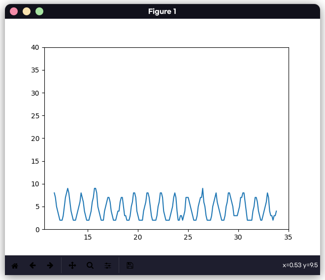
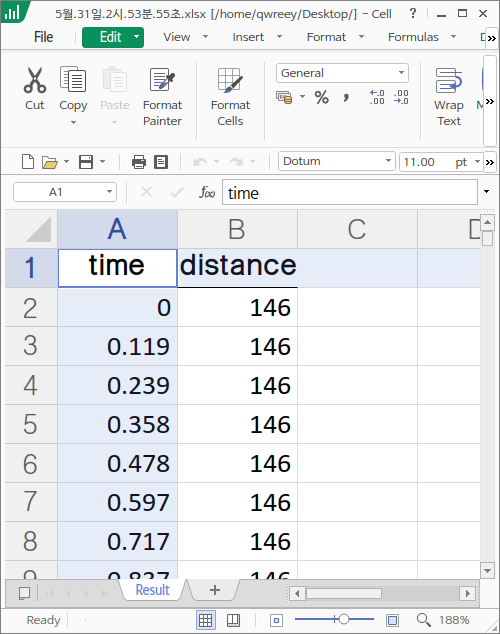

# 진자운동 데이터 처리

아두이노에서 측정한 진자운동 데이터를 pandas 라이브러리를 통해 xlsx 파일로 내보내며, matplotlib 라이브러리를 통해 실시간 미리보기를 보여줍니다.
또한, 미리보기 창에서 저장해야할 그래프를 저장할 수 있습니다.

## 결과물

|||
|-|-|
|  |  |

## 사용과정

1. 파이썬, 파이썬 모듈, 파일 받기

[python.org](https://www.python.org) 에서 파이썬을 다운받습니다.

이 저장소 페이지 상단에 초록 Code 버튼을 누르고 Donwload ZIP 를 눌러 파일을 받습니다.

받은 zip 파일을 풀고 풀린 폴더에 들어가서 cmd 창을 엽니다 (탐색기 주소 부분을 클릭하고 cmd 입력후 엔터)

```
pip install -r requirement.txt
```

필요한 파이썬 모듈을 받습니다.

2. 아두이노 설치

아두이노 코드파일은 sketch_may30a 에 들어있습니다.
sketch_may30a 폴더 안 ino 파일을 열고 컴파일해 아두이노에 올려줍니다

그 다음 아두이노 편집기를 완전히 끕니다 (중요! 파이썬과 아두이노 편집기가 같이 아두이노 출력을 읽으려 하면 오류가 발생합니다.)

3. 파이썬 열기

이제 cmd 명령창에 `py main.py`  를 입력후 엔터를 누릅니다 (py 가 없다고 오류가 뜨면 `python main.py` 또는 `python3 main.py` 를 입력해보세요).
안내에 따라서 아두이노가 연결된 포트를 입력합니다 (아두이노 창에서 도구 => 포트 부분에 따옴포 안에 적힌걸 옮겨 적으면 됩니다 (괄호 부분은 적지말고) 예시: COM1, COM2, COM3, COM4, COM5, /dev/ttyS0, /dev/ttyACM0)
보드레이트의 경우 sketch_may30a 에 파일을 아두이노에 올렸다면 그냥 엔터만 누르면 자동으로 9600 이 선택됩니다.

안내에 따라 설정을 마치면 측정이 시작됩니다. 시작후 데이터는 엑셀에 담기며, 실시간 미리보기에서 1분간의 그래프를 볼 수 있습니다 (아래 보이는 그래프를 저장버튼을 눌러 저장할 수 있습니다)

측정을 완료했다면 cmd 명령창에 엔터를 입력합니다.

그러면 폴더에 끝난 시간을 이름으로 하는 엑셀 파일이 생성됩니다. 이 엑셀 파일에는 시간(second) 거리(cm) 이 담겨있습니다.

## 주의사항

열린 그래프 창을 직접 닫지 마세요, 명령창에 엔터키를 누르면 파일이 저장되며 자동으로 닫히게 됩니다.
그래프 창을 직접 닫으면 스레드 풀이 난장판이 되어(...) 파일이 저장되지 못할 수 있습니다.

측정 시간은 오차를 없에기 위해 아두이노의 내부시계를 이용합니다. 이 내부 시계는 최대치가 있으며 해당 값을 넘어가면 오버플로우로 음수 값이 출력될 수 있습니다.

시간이 음수가 출력되는 경우, 아두이노를 컴퓨터에서 분리한 후, 다시 연결하고 대략 10초쯤 뒤 다시 파이썬을 실행해 주세요.

엑셀파일은 이름에 시간이 적힌 채로 저장됩니다.
(e: 5월.31일.2시.53분.55초.xlsx)
template.xlsx 는 데이터가 들어가기 위한 틀에 해당하는 파일로 편집하면 안됩니다.
